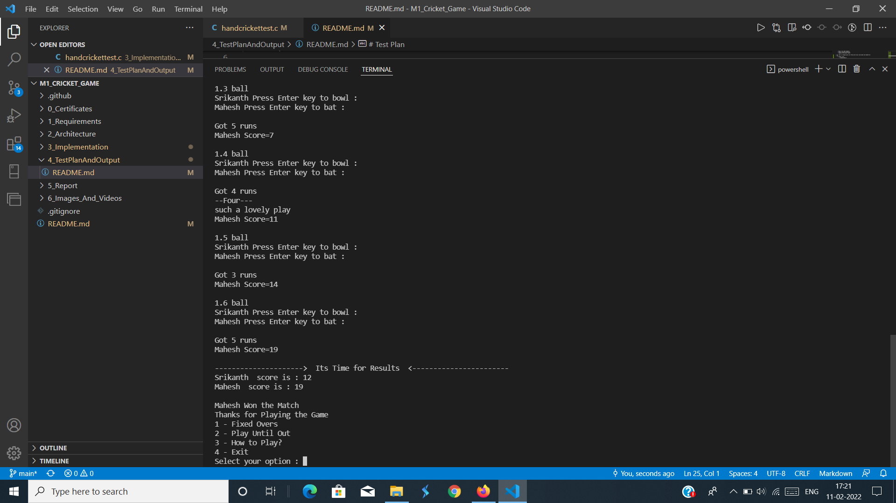
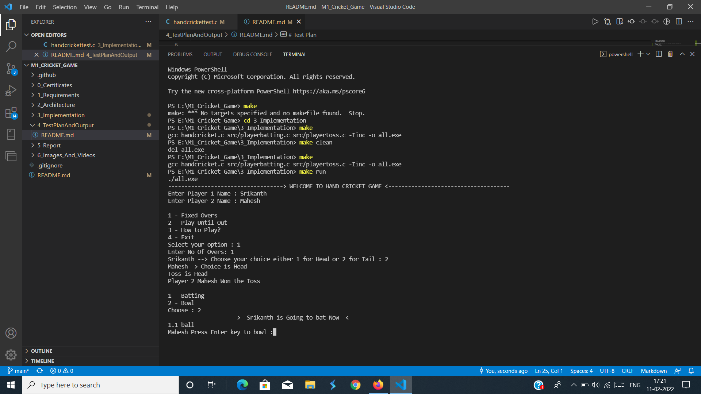

# Test Plan

* All code is categerosied into three parts main sourcecode and headerfile 
* inc
    * header files
        * handcricket.h
* src
    * source files represents batting and toss
        * playerbatting.c and playertoss.c

* main code which is
    * handcricket.c file this is main file

* Makefile 
    * with this file we run this game where we merge the all folders code such as source code and headerfiles and maincode and make them compile and run without errors 

* unity
    * consists of unittest file which is handcrickettest with this file we run the testcases , here we pass the testcases to the fie and make the expected output to the given inputs
    * it consists of unittesting files which are present in unity folder with the help of that unity files we run the testcases withn the handcrickettest file

### Testcase

* Here we pass two names which asks us to give and after we give that names it asks us to choose the toss, after choosing the tos it shows who own the toss, and asks the winner to select batting/bowling, After select batting/bowling it asks the player to eneter to bowl and batsmen to enter to bat and after that it sums the batsmen score until gameover and repeat same with another batsmen and At the last it shows both players score , Whoever score more he is the winner and says congrats.

#### Captured screenshots

# Table
* ID, Description of the test cases , input values , Expected Output, Actual output

| ID | Description | input values | Expected output | Actual Output |
|----|-------------|--------------|-----------------|---------------|
| '1' | Passing names of players, it saves names and make the players to choose the toss  | Dhoni,Virat | Dhoni win the toss | Dhoni win the toss |
| '2' | toss winner selecting batting/bowling if he selected batting then it prints another one is bowling | batting | Dhoni choose batting | Dhoni choose batting |