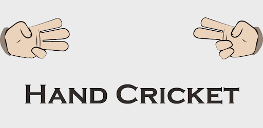

# M1_Cricket_Game

* Cricket Game Mini Project in c programm

# SDLC Activity Based Learning 
|Build| Code Quality | Unity | Git inspector | 
|-----|--------------|-------|---------------|
||     |        |  |

## Folder Structure
| Folder | Description |
|--------|-------------|
| 1_Requiremets | Documents detailing Requirements(High level and Low level requirements) |
| 2_Architecture | Structural and Behavioural design(Flow charts , usecase diagrams) |
| 3_Implementation | All code and code files |
| 4_TestPlanAndOutput | Documents with test plan and output |
| 5_Report | Whole Report of the project |
| 6_Images_And_Videos | Project necessary images and videos wiil be here |

# Contriutors List and Summary

| PS NO. | Name | Features |
|--------|------|----------|
| 99007538 | Srikanth Bandi | Entire Project: Requirements, Architecture, Implementation, Test plan,Report |

# References

* Cricket - The game of life implementation book by __Scyld Burry__
* W3 Schools, Geeks for geeks